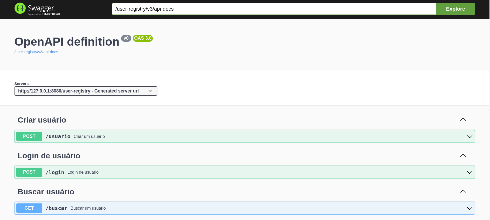
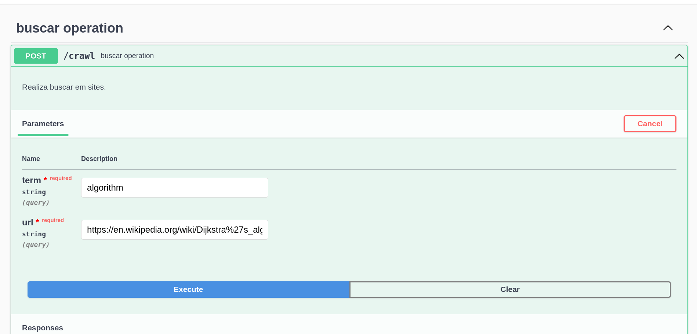
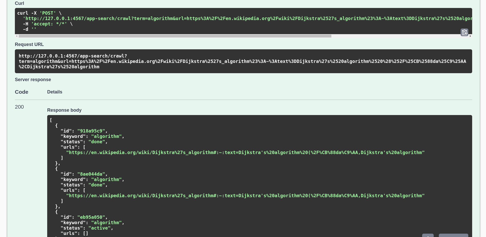
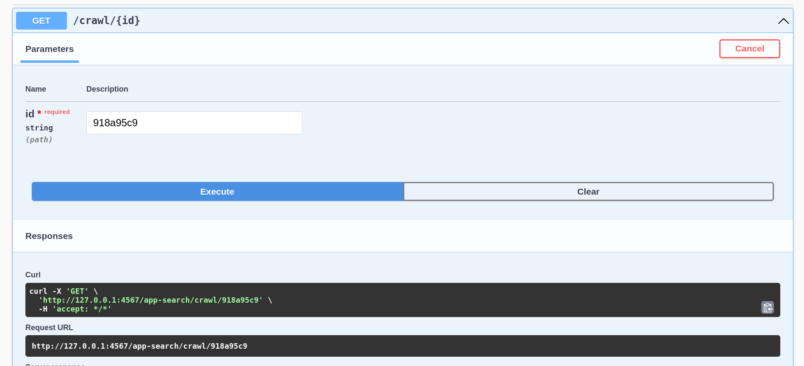
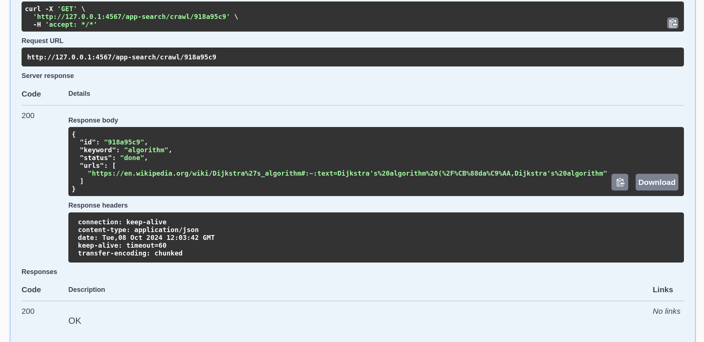

Este projeto é uma demostração de uma aplicação de busca , construída com Java e Spring Boot.

### Comportamento

Aplicação navega por um website em busca de um termo fornecido
pelo usuário e lista as URLs onde o termo foi encontrado.

POST: inicia uma nova busca por um termo (keyword).

GET: consulta resultados de busca.

### Executar a aplicação backend 

Pré-requisitos

 -  Java 17
 -  Maven

# Executar os comandos maven :

 mvn clean install
   
 mvn spring-boot:run
 
 
 
# Para executar a aplicação com Docker :
 
 docker build . -t jsn-search-app

 docker run  -p 4567:4567 --rm jsn-search-app 
 

# Para acessar a API da aplicação:
http://127.0.0.1:4567/jsn-search/swagger-ui/index.html

