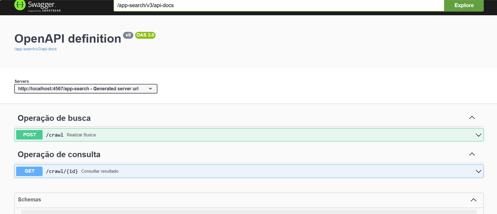

#  Search Crawler API

API de busca que varre websites e retorna URLs onde um termo foi encontrado

Uma aplicação backend simples e eficiente para executar buscas automatizadas em páginas web a partir de uma palavra-chave.

#  Problema real

Buscar manualmente por um termo em múltiplas páginas de um site é:

demorado

repetitivo

pouco confiável

Ferramentas genéricas nem sempre permitem controle, histórico ou integração via API.

#  Solução

Este projeto fornece uma API REST que:

inicia buscas automatizadas em websites a partir de um termo

percorre páginas do site

identifica onde o termo aparece

armazena e disponibiliza os resultados via API

Tudo isso de forma simples, stateless e fácil de integrar.

#  Funcionalidades

Início de busca por palavra-chave (POST)

Varredura de páginas de um website

Listagem das URLs onde o termo foi encontrado

Consulta de resultados de buscas já executadas (GET)

Documentação automática com Swagger

Execução local ou via Docker

#  Stack

Java 17

Spring Boot

Maven

Docker

Swagger (OpenAPI)

#  Arquitetura

Client (Swagger / API Consumer)
        ↓
REST API (Spring Boot)
        ↓
Search Service (Crawler)
        ↓
Resultados da busca

Arquitetura simples, focada em clareza e responsabilidade única.

#  Como rodar localmente
Pré-requisitos

Java 17

Maven

Docker (opcional)

Executando com Maven :
 
 mvn clean install
 
 mvn spring-boot:run

A aplicação sobe em:

http://localhost:4567

Swagger:

http://127.0.0.1:4567/app-search/swagger-ui/index.html

#  Executando com Docker
Build da imagem
docker build . -t jsn-search-app

Rodando o container
docker run -p 4567:4567 --rm jsn-search-app

#  CI/CD 

Pipeline automatizado com:

build da aplicação

build da imagem Docker

push para registry

deploy no Kubernetes

Fluxo correto (produção)

#### 1 - Alterou o código

git commit -am "nova feature"

#### 2 - Build da imagem

docker build -t seu-usuario/jsn-search-app:1.1.0 .

#### 3 - Push para o registry

docker push seu-usuario/jsn-search-app:1.1.0

#### 4 - Atualiza o deployment

kubectl set image deployment/jsn-search-app jsn-search-app=seu-usuario/jsn-search-app:1.1.0

O Kubernetes realiza rolling update automaticamente.

# Demonstração

Swagger UI com endpoints documentados

Execução de busca por keyword

Retorno das URLs encontradas

# Decisões técnicas

Spring Boot pela rapidez de setup e maturidade para APIs REST

Swagger para facilitar testes e consumo da API

Docker para padronizar execução em qualquer ambiente

Separação clara entre controller, service e lógica de busca

# Próximos passos

Persistência dos resultados em banco de dados

Busca assíncrona com fila RabbitMQ

Paginação e filtros nos resultados

Controle de profundidade de navegação

Rate limit e timeout configurável
